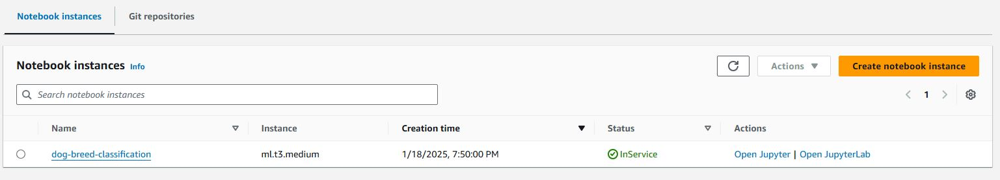
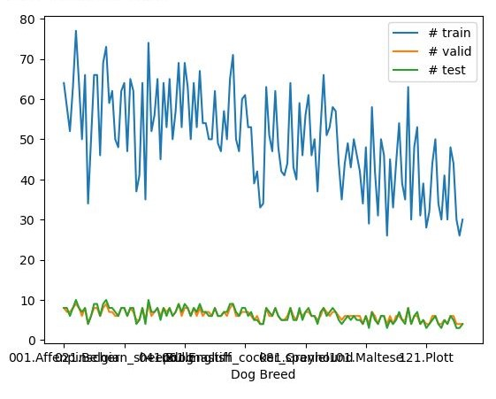
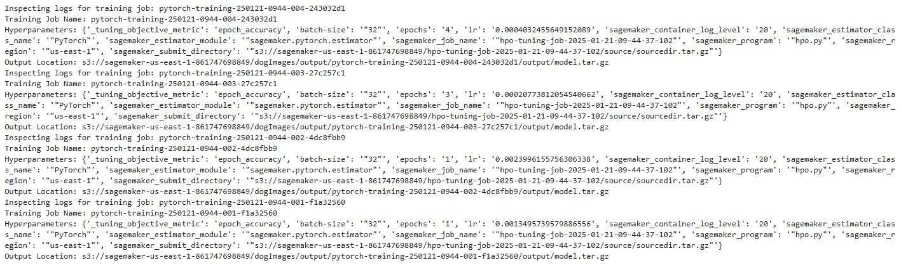
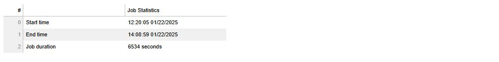
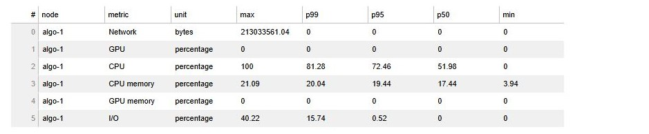
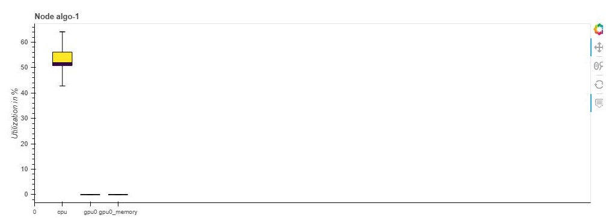
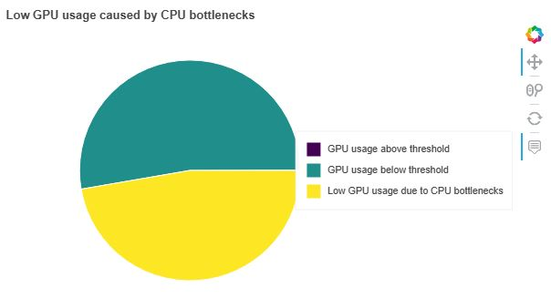
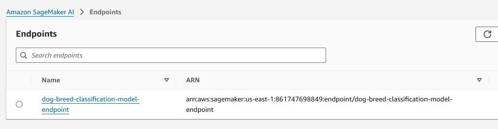

# Image Classification with AWS SageMaker

Task: Train a pretrained model that can perform image classification by using the AWS Sagemaker profiling, debugger, hyperparameter tuning and other ML engineering practices.

The primary goal of this project is to demonstrate the setup of an ML infrastructure that can facilitate the training of accurate models. It's not just about achieving high accuracy but about understanding and implementing the end-to-end process that makes ML development sustainable, scalable, and efficient. We will use a pretrained image classification model to classify the dog breed, given an image of the dog. This will be done by loading the pretrained model then using transfer learning we adapt the model to the dog breed classification dataset.

## Project Set Up and Installation

- Clone Github repository or download the starter files.
- Enter AWS  and open SageMaker Studio.
- Download and make the dataset available.
- Create notebook instance, load files to JupyterLab, start developing notebook.

  

This project contains the following files: 

[**train_and_deploy.ipynb**](./train_and_deploy.ipynb): Jupyter notebook used in JupyterLab to perform the complete workflow from environment setup to model deployment. 
[**hpo.py**](./hpo.py): Python script file used for hyperparameter optimization 
[**train_model.py**](./train_model.py): Python script used for model training and deployment. 
[**inference.py**](./inference.py): Python script prepares the model for inference. 

### Project Steps

The following project steps will be performed
- envionment setup,
- data upload and exploration,
- hyperparameter tuning,
- model profiling and debugging,
- model deploying and prediction.

## Dataset

### Access

You can access the data in several ways. You can download the data from "https://s3-us-west-1.amazonaws.com/udacity-aind/dog-project/dogImages.zip", unzip it onto your local machine and upload the data directly to your S3 buckets.
Alternatively you can upload the zip file into your JupyterLab file explorer and then use code in your Jupyter notebook (e.g. [**train_and_deploy.ipynb**](./train_and_deploy.ipynb) ) to extract the data and sync the data to your S3 buckets.

### Overview

The provided dataset is a dog breed classification dataset. It contains images of 133 dog breeds divided into datasets for training, testing and validation. In total more than 8000 image files.

  

## Hyperparameter Tuning

Hyperparameter tuning in Amazon SageMaker is used to automatically optimize the hyperparameters of a machine learning model to achieve the best possible performance on a specific objective metric, such as accuracy, F1 score, or loss. Hyperparameters are configuration settings that control the training process, such as learning rate, batch size, and the number of layers in a neural network. The learning rate in our case ranged **beteen 0.001 and 0.1**, the **batch size values are 32, 64, and 128**. We were aiming to maximise accuracy.

**Hyperparameter Tuning Steps:** 
The notebook highlights hyperparameter tuning to optimize model performance by fine-tuning a pre-trained model in SageMaker. 
**Hyperparameter Setup:** Defines a range of hyperparameters (lr, batch-size, epochs) using SageMaker’s ContinuousParameter, CategoricalParameter, and IntegerParameter. 
**Hyperparameter Tuner Creation:** Creates a HyperparameterTuner object with configurations like objective_metric_name, tuning ranges, job limits, and metric definitions. 
**Hyperparameter Tuning Execution:** Runs the tuning process with tuner.fit using S3 paths for training and validation datasets. 
**Accessing Results:** Demonstrates fetching the best hyperparameters from the tuning job. 
**Best Hyperparameter Selection:** Constructs a dictionary of the best hyperparameters, including batch size and learning rate. 
**Optional Estimator Attachments:** Provides flexibility to attach and control the estimator outside the tuner context. 
**Metric Analysis:** Includes definitions and regex for tracking metrics like epoch_accuracy and epoch_loss during tuning. 
**Parallel Jobs:** Configures parallel jobs to accelerate hyperparameter tuning without exceeding resource limits. 
**Validation Strategy:** Specifies a split between training and validation datasets for robust tuning outcomes. 

  

  

The image above shows the completed hyperparameter jobs. The image below shows the completed training jobs of one hyperparameter job.

  

  

The image below shows the retrieve of the completed jobs and the job with the best result.

  

  

## Debugging and Profiling

Debugging and profiling in Amazon SageMaker are essential for identifying performance bottlenecks and ensuring model correctness during training and inference. SageMaker provides powerful tools like SageMaker Debugger and SageMaker Profiler to streamline these processes.

For debugging and profiling the model we defined rules, collection_configs, hook_config, and profiler_config, which we passed to the Sagemaker estimator.

### Results

The [profiler report](./ProfilerReport/profiler-output/profiler-report.html) can be found under the directory ProfilerReport inside the directory project-output.

  

  

  

The following image shows a screenshot of the CPU utilization during the training process:

  

  

## Model Deployment

For this experiment whe chose the Resnet-50 (residual neural network). ResNet50 is a deep convolutional neural network (CNN) architecture that was developed by Microsoft Research in 2015. It is a variant of the popular ResNet architecture, which stands for “Residual Network.” The “50” in the name refers to the number of layers in the network, which is 50 layers deep. (Source: [medium.com](https://medium.com/@nitishkundu1993/exploring-resnet50-an-in-depth-look-at-the-model-architecture-and-code-implementation-d8d8fa67e46f))

**Model Deployment and Testing Steps:**
**Training Job Monitoring:** Fetches details of the latest training job for review, including the job name, client, and description. 
**Creating/Managing/Listing Endpoint Deployment:** Deploys the trained model to a SageMaker endpoint with specific instance configurations and an endpoint name. Provides commands to list active SageMaker endpoints for monitoring. 

**Error Logging:** Includes methods to locate inference errors or failures in S3 logs for debugging. 

  

  

**Endpoint Cleanup:** Remember to delete endpoints once testing or deployment is complete to avoid incurring costs. This can be done via console or Jupyter notebook. 

  

